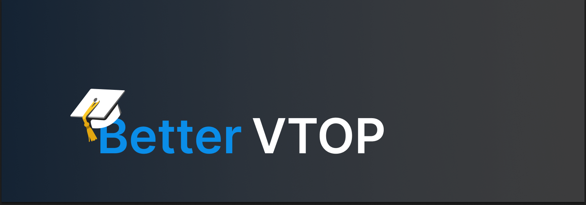
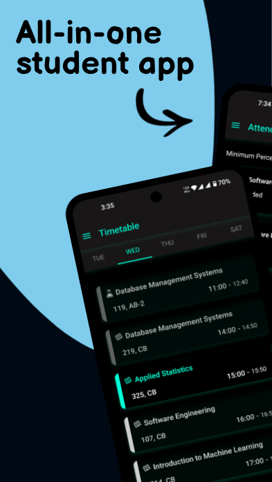
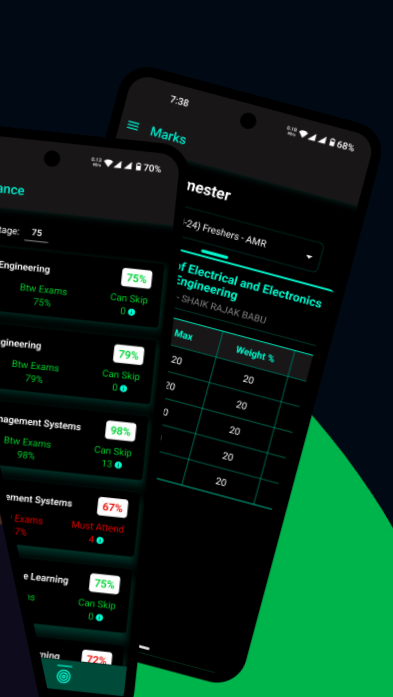
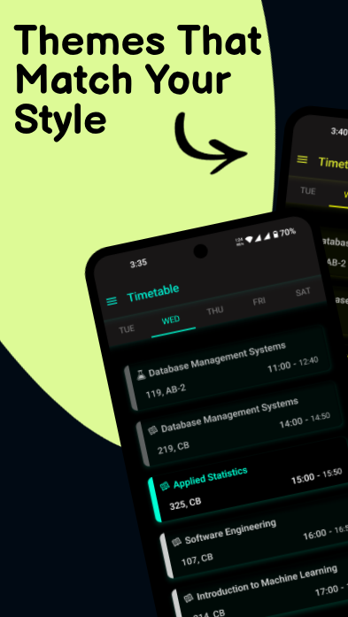
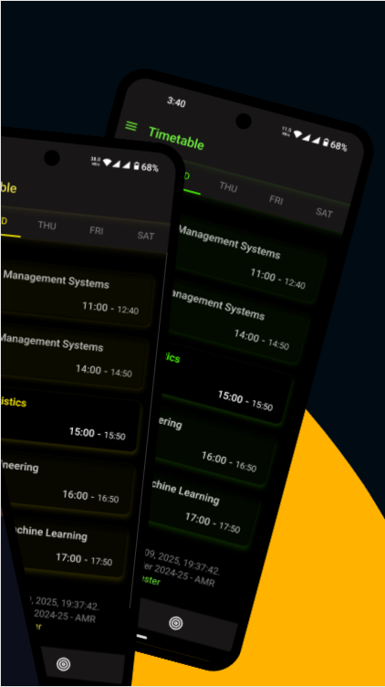
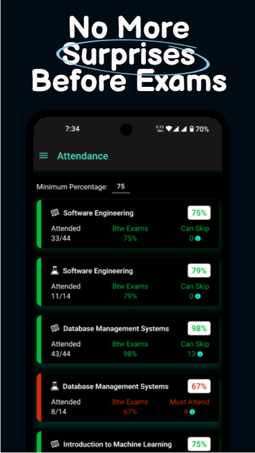
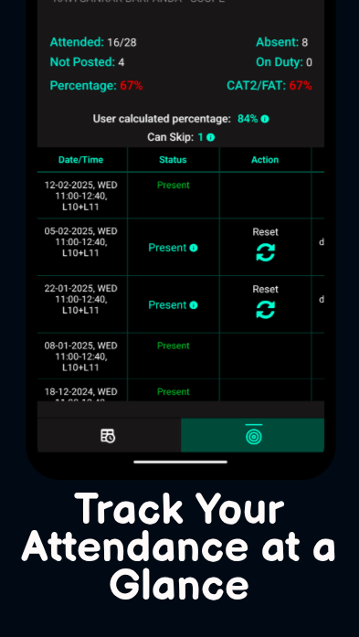

<p align="center">
  
</p>

# BetterVTOP

**BetterVTOP** is an unofficial, student-made companion app for VIT AP’s VTOP portal. Designed with a clean UI and student-focused experience, it provides fast access to your attendance, timetable, and academic data — all in one place.

## 👉 You can download and try the APK from the [Releases page](https://github.com/sathwikv2005/BetterVTOP-VITAP/releases).

---

## 📱 App Screenshots

<p float="left">
  
  
</p>

<p float="left">
  
  
</p>

<p float="left">
  
  
  
</p>

---

## ⚠️ Disclaimer

> **BetterVTOP is an _unofficial_ app and is not affiliated with VIT or the VTOP portal.**  
> It is developed and maintained by a student, for students.

---

## 🚀 Getting Started

### Prerequisites

- Node.js
- Expo CLI
- EAS CLI
- Android/iOS Emulator or real device

### Installation

```bash
git clone https://github.com/your-username/BetterVTOP.git
cd BetterVTOP
npm install
```

### Development

```bash
npx expo start
```

### Production Build

```bash
eas build -p android --profile preview
```

_Ensure you have configured your `eas.json` and `app.config.js` correctly._

---

## 🛠️ Built With

- [React Native](https://reactnative.dev/)
- [Expo](https://expo.dev/)
- [EAS Build](https://docs.expo.dev/build/introduction/)

---

> Star ⭐ the repo if you find it helpful!
